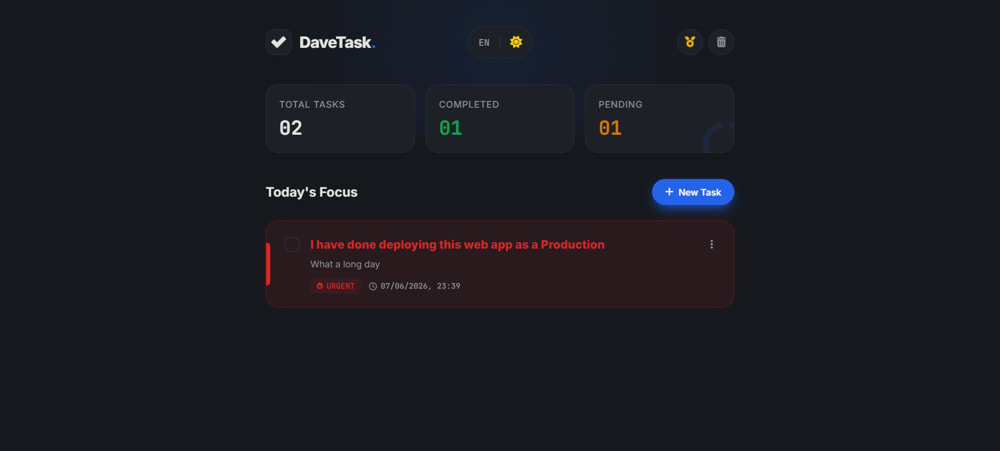
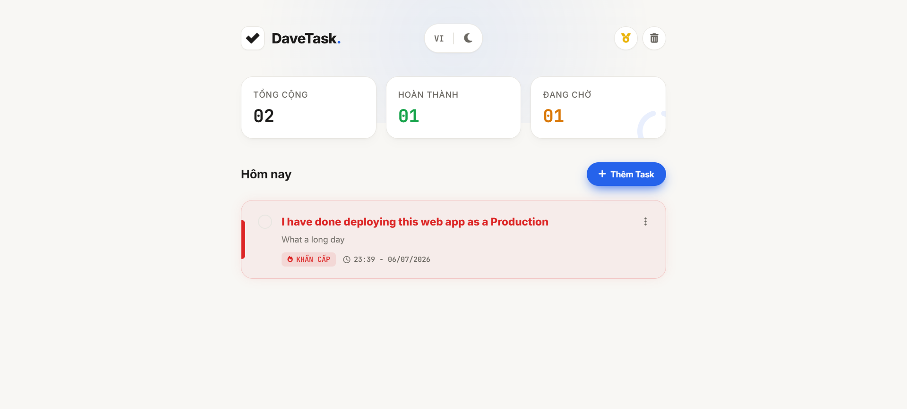
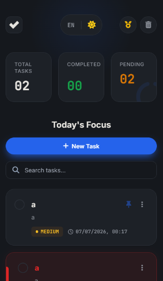
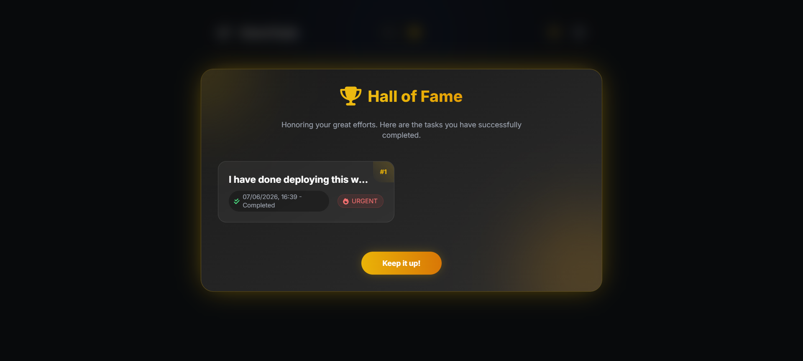
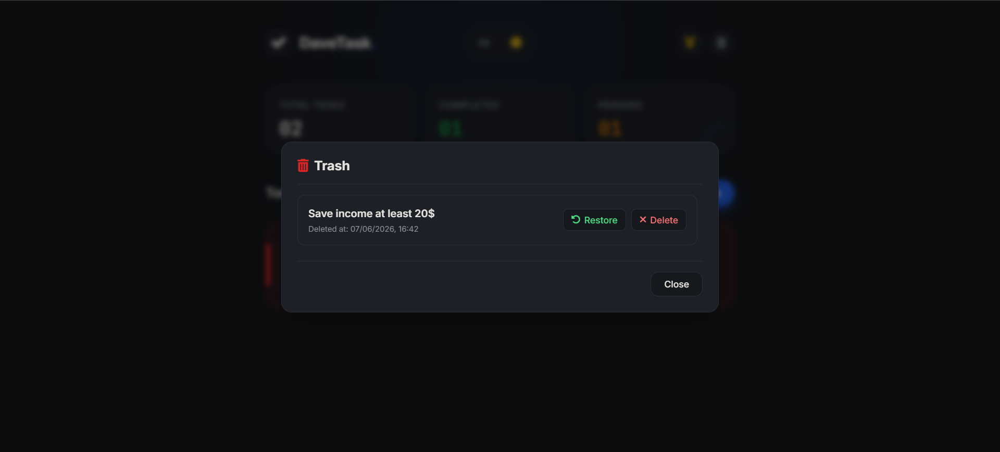

<div align="center">
  

  <h1>🚀 DaveTask - Premium Full-Stack Task Management</h1>
  
  <p>
    <b>A highly scalable, beautifully designed Full-Stack Task Management web application.</b><br>
    Built with React (Vite), Spring Boot 3, and MySQL (Aiven Cloud).
  </p>

  <p>
    <a href="#english">🇬🇧 English</a> • <a href="#vietnamese">🇻🇳 Tiếng Việt</a>
  </p>

  <p>
    <a href="https://dave-todo-webapp.vercel.app/home"><strong>🔴 View Live Demo (Vercel)</strong></a>
    ·
    <a href="https://todo-webapp-6tui.onrender.com/api/health"><strong>🟢 Check Backend Status (Render)</strong></a>
  </p>

  <p>
    
    
    
    
    
  </p>
</div>

<hr>

<h2 id="english">🇬🇧 English Version</h2>

Welcome to the **DaveTask** repository! This project was engineered to demonstrate my proficiency in building **Enterprise-grade Full-Stack applications**.

### 🌟 Key Features
- **Clean Architecture:** Strict separation of concerns in both Frontend and Backend.
- **Advanced Exception Handling:** `@RestControllerAdvice` with standard JSON `ErrorResponse`.
- **Database Version Control:** Flyway migrations ensuring seamless schema tracking.
- **Modern UI/UX:** Glassmorphism, animations, dark/light mode, and full mobile responsiveness.
- **Internationalization (i18n):** Seamlessly switch between English and Vietnamese.

### 📸 Application Showcase

| Light Mode (Vietnamese) | Dark Mode (English) |
| :---: | :---: |
|  |  |

| Mobile Responsiveness | Interactive UX (Done / Delete) |
| :---: | :---: |
|  | <br> |

### 🧪 Live APIs (Test it yourself!)
The backend is fully deployed on Render. You can test these endpoints directly in your browser or via Postman/cURL:
- **Health Check (GET):** [https://todo-webapp-6tui.onrender.com/api/health](https://todo-webapp-6tui.onrender.com/api/health)
- **Fetch All Tasks (GET):** [https://todo-webapp-6tui.onrender.com/api/tasks](https://todo-webapp-6tui.onrender.com/api/tasks)

### ⚙️ How to Run Locally

**1. Clone the repository:**
```bash
git clone https://github.com/thanhdattt2006/todo-webapp.git
cd todo-webapp
```

**2. Start the Backend:**
Ensure you have an active MySQL server and configure `application.yml` with your database credentials.
```bash
cd backend
./mvnw spring-boot:run
```

**3. Start the Frontend:**
```bash
cd frontend
npm install
npm run dev
```
*Access the app at `http://localhost:5173`*

<hr>

<h2 id="vietnamese">🇻🇳 Phiên bản Tiếng Việt</h2>

Chào mừng đến với **DaveTask**! Dự án này được xây dựng từ con số 0 nhằm minh chứng kỹ năng thiết kế và phát triển hệ thống **Full-Stack chuẩn Enterprise**.

### 🌟 Tính năng Nổi bật
- **Kiến trúc mã nguồn sạch (Clean Architecture):** Tách biệt rõ ràng các tầng logic.
- **Xử lý lỗi tập trung:** Bắt lỗi Global với `@RestControllerAdvice` và trả về JSON chuẩn xác.
- **Quản lý Database chuyên nghiệp:** Dùng Flyway để tự động tạo bảng và quản lý phiên bản CSDL.
- **Giao diện Hiện đại (UI/UX):** Phong cách Glassmorphism, Animation mượt mà, hỗ trợ Dark/Light Mode.
- **Đa ngôn ngữ (i18n):** Hỗ trợ chuyển đổi Tiếng Việt và Tiếng Anh tức thì.

### 🧪 Các API Đang Chạy (Live APIs)
Hệ thống Backend đang được chạy trên Render Cloud. Bạn có thể bấm vào link để test trực tiếp:
- **Kiểm tra trạng thái máy chủ (GET):** [https://todo-webapp-6tui.onrender.com/api/health](https://todo-webapp-6tui.onrender.com/api/health)
- **Lấy danh sách Công việc (GET):** [https://todo-webapp-6tui.onrender.com/api/tasks](https://todo-webapp-6tui.onrender.com/api/tasks)

### ⚙️ Hướng dẫn Chạy Local

**1. Tải source code:**
```bash
git clone https://github.com/thanhdattt2006/todo-webapp.git
cd todo-webapp
```

**2. Chạy Backend (Spring Boot):**
Mở thư mục `backend`, vào file `application.yml` điền thông tin MySQL của bạn vào các biến môi trường hoặc cấu hình mặc định.
```bash
cd backend
./mvnw spring-boot:run
```

**3. Chạy Frontend (React Vite):**
```bash
cd frontend
npm install
npm run dev
```
*Mở trình duyệt và trải nghiệm tại `http://localhost:5173`*

---
**Architect & Developer:** [@thanhdattt2006](https://github.com/thanhdattt2006)
